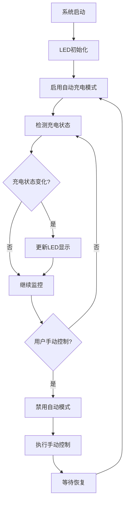

# LED充电状态显示功能

## 功能概述

本功能实现了LED根据设备充电状态自动切换显示效果，提供直观的充电状态指示。

## 功能特性

### 🔋 充电状态显示
- **充电中**: 绿灯呼吸效果（约20%亮度）
- **未充电**: 绿色常亮（2%亮度）
- **低电量警告**: 电量≤10%时红灯快闪（20%亮度）

### 🎛️ 智能模式切换
- **自动模式**: 默认启用，根据充电状态自动调整LED显示
- **手动模式**: 当用户手动设置LED状态时，暂时禁用自动模式
- **状态恢复**: 手动控制后，系统会自动恢复到充电状态显示模式

## 技术实现

### 核心组件

#### 1. LEDManager类扩展
```cpp
class LEDManager {
private:
    bool _lastChargingState;  // 记录上次充电状态
    bool _autoChargingMode;   // 自动充电显示模式开关
    
public:
    void updateChargingStatus();           // 更新充电状态显示
    void setChargingDisplay(bool isCharging); // 设置充电显示
};
```

#### 2. 充电状态检测
- 通过 `bat.isCharging()` 获取实时充电状态
- 检测充电状态变化，避免频繁更新
- 状态变化时自动切换LED显示效果

#### 3. LED显示逻辑
```cpp
void LEDManager::setChargingDisplay(bool isCharging) {
    if (isCharging) {
        // 充电中：绿灯呼吸效果
        _mode = LED_BREATH;
        _color = LED_COLOR_GREEN;
        _brightness = 50; // 约20%亮度
    } else {
        // 未充电：绿色2%亮度常亮
        _mode = LED_ON;
        _color = LED_COLOR_GREEN;
        _brightness = 5; // 2%亮度
    }
}
```

### 工作流程



## 配置参数

### LED亮度设置
```cpp
// 充电状态LED亮度配置
#define CHARGING_BRIGHTNESS    50  // 充电时呼吸效果亮度 (20%)
#define NORMAL_BRIGHTNESS      5   // 未充电时常亮亮度 (2%)
#define LOW_BATTERY_BRIGHTNESS 20  // 低电量警告亮度 (8%)
```

### 电量阈值
```cpp
// 电量警告阈值
#define LOW_BATTERY_THRESHOLD  10  // 低电量警告阈值 (10%)
```

## 使用说明

### 正常使用
1. 设备启动后，LED自动显示充电状态
2. 插入充电器：LED变为绿灯呼吸效果
3. 拔出充电器：LED变为绿色微亮常亮
4. 电量过低：LED变为红灯快闪警告

### 手动控制
```cpp
// 手动设置LED状态（会暂时禁用自动模式）
ledManager.setLEDState(LED_ON, LED_COLOR_BLUE, 10);

// 系统会在适当时机自动恢复充电状态显示
```

## 功耗优化

### 低功耗设计
- **未充电状态**: 2%亮度最小化功耗
- **充电状态**: 适中亮度提供清晰指示
- **智能控制**: 避免不必要的LED更新

### 功耗对比
| 状态 | LED模式 | 亮度 | 预估功耗 |
|------|---------|------|----------|
| 未充电 | 常亮 | 2% | ~0.5mA |
| 充电中 | 呼吸 | 20% | ~2-5mA |
| 低电量 | 快闪 | 8% | ~1-3mA |

## 调试信息

### 串口输出
```
[LEDManager] 充电状态变化: 充电中
[LEDManager] 充电状态变化: 未充电
[PWMLED] 设置模式: LED_BREATH, 颜色: GREEN, 亮度: 50
[PWMLED] 设置模式: LED_ON, 颜色: GREEN, 亮度: 5
```

### 状态监控
- 充电状态变化会在串口输出日志
- LED模式切换会显示详细参数
- 支持实时监控充电状态和LED状态

## 测试验证

### 自动化测试
使用 `test/test_led_charging.py` 脚本进行功能测试：

```bash
cd test
python3 test_led_charging.py /dev/cu.usbserial-0001
```

### 手动测试步骤
1. **充电状态测试**
   - 插入充电器，观察LED变为绿灯呼吸
   - 拔出充电器，观察LED变为绿色微亮
   
2. **低电量测试**
   - 等待电量降至10%以下
   - 观察LED变为红灯快闪
   
3. **手动控制测试**
   - 发送LED控制命令
   - 确认自动模式暂时禁用
   - 观察系统自动恢复

## 故障排除

### 常见问题

#### LED不响应充电状态变化
- **检查**: 确认 `bat.isCharging()` 功能正常
- **解决**: 检查充电检测引脚配置

#### LED亮度不符合预期
- **检查**: 确认PWM LED硬件连接
- **解决**: 调整亮度参数或检查硬件

#### 自动模式不工作
- **检查**: 确认 `_autoChargingMode` 标志状态
- **解决**: 重启设备或手动重置模式

### 调试命令
```cpp
// 强制启用自动充电模式
ledManager._autoChargingMode = true;

// 手动触发充电状态检测
ledManager.updateChargingStatus();
```

## 版本历史

### v4.2.0 (2025-07-25)
- ✅ 实现基础充电状态LED显示功能
- ✅ 添加自动/手动模式切换
- ✅ 优化低功耗设计
- ✅ 完善调试和测试功能

## 相关文档

- [电源管理文档](power_management.md)
- [LED系统文档](led_system.md)
- [低功耗优化文档](power_optimization.md)
